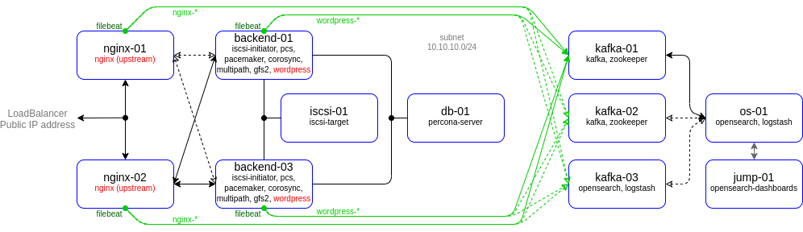
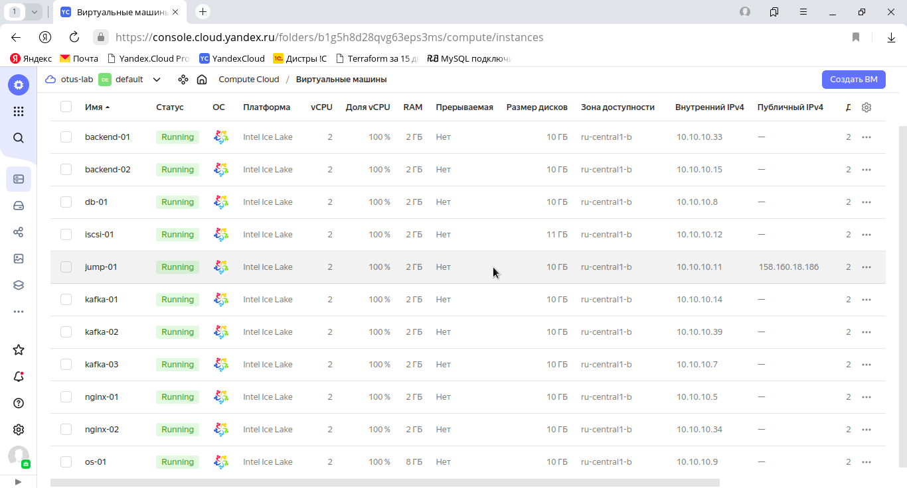

# lab-08
otus | kafka

### Домашнее задание
Реализация очереди для сборщика логов между logstash и elasticsearch

#### Цель:
настроить сбор логов с веб портала реализованного ранее
настроить kafka как промежуточную очередь между logstash и elasticsearch

#### Описание/Пошаговая инструкция выполнения домашнего задания:
развернуть кафку на 1 ноде
создать 2 топика по 2 партиции и 2 реплики (nginx и wordpress)
на каждой ноде поставить на выбор filebeat/fluentd/vector
собирать этим утилитами логи nginx и wordpress
отправлять в 2 разных топика nginx и wordpress
развернуть ELK на одной ноде
настроить логстэш для забора данных с кафки и сохранение в 2 индекса
настроить индекс паттерны в кибане
Задание повышенной сложности* кафку и ELK развернуть в кластере

Критерии оценки:
Статус "Принято" ставится при выполнении перечисленных требований.
Задание со звездочкой выполняется по желанию.


### Выполнение домашнего задания

#### Создание стенда

Стенд будем разворачивать с помощью Terraform на YandexCloud, настройку серверов будем выполнять с помощью Ansible.

Необходимые файлы размещены в репозитории GitHub по ссылке:
```
https://github.com/SergSha/lab-08.git
```

Схема:



Для начала получаем OAUTH токен:
```
https://cloud.yandex.ru/docs/iam/concepts/authorization/oauth-token
```

Настраиваем аутентификации в консоли:
```
export YC_TOKEN=$(yc iam create-token)
export TF_VAR_yc_token=$YC_TOKEN
```

Скачиваем проект с гитхаба:
```
git clone https://github.com/SergSha/lab-07.git && cd ./lab-07
```

В файле provider.tf нужно вставить свой 'cloud_id':
```
cloud_id  = "..."
```

При необходимости в файле main.tf вставить нужные 'ssh_public_key' и 'ssh_private_key', так как по умолчанию соответсвенно id_rsa.pub и id_rsa:
```
ssh_public_key  = "~/.ssh/id_rsa.pub"
ssh_private_key = "~/.ssh/id_rsa"
```

Для того чтобы развернуть стенд, нужно выполнить следующую команду, вставляя свои значения (пароли) для переменных admin_password, kibanaserver_password, logstash_password:
```
terraform init && terraform apply -auto-approve && \
sleep 60 && ansible-playbook ./provision.yml \
--extra-vars "admin_password=admin@Otus1234 \
kibanaserver_password=kibana@Otus1234 \
logstash_password=logstash@Otus1234"
```

По завершению команды получим данные outputs:
```
Outputs:

backend-servers-info = {
  "backend-01" = {
    "ip_address" = tolist([
      "10.10.10.5",
    ])
    "nat_ip_address" = tolist([
      "",
    ])
  }
  "backend-02" = {
    "ip_address" = tolist([
      "10.10.10.13",
    ])
    "nat_ip_address" = tolist([
      "",
    ])
  }
}
db-servers-info = {
  "db-01" = {
    "ip_address" = tolist([
      "10.10.10.12",
    ])
    "nat_ip_address" = tolist([
      "",
    ])
  }
}
iscsi-servers-info = {
  "iscsi-01" = {
    "ip_address" = tolist([
      "10.10.10.40",
    ])
    "nat_ip_address" = tolist([
      "",
    ])
  }
}
jump-servers-info = {
  "jump-01" = {
    "ip_address" = tolist([
      "10.10.10.8",
    ])
    "nat_ip_address" = tolist([
      "51.250.22.210",
    ])
  }
}
loadbalancer-info = toset([
  {
    "external_address_spec" = toset([
      {
        "address" = "158.160.130.50"
        "ip_version" = "ipv4"
      },
    ])
    "internal_address_spec" = toset([])
    "name" = "http-listener"
    "port" = 80
    "protocol" = "tcp"
    "target_port" = 80
  },
])
nginx-servers-info = {
  "nginx-01" = {
    "ip_address" = tolist([
      "10.10.10.31",
    ])
    "nat_ip_address" = tolist([
      "",
    ])
  }
  "nginx-02" = {
    "ip_address" = tolist([
      "10.10.10.6",
    ])
    "nat_ip_address" = tolist([
      "",
    ])
  }
}
os-servers-info = {
  "os-01" = {
    "ip_address" = tolist([
      "10.10.10.17",
    ])
    "nat_ip_address" = tolist([
      "",
    ])
  }
  "os-02" = {
    "ip_address" = tolist([
      "10.10.10.11",
    ])
    "nat_ip_address" = tolist([
      "",
    ])
  }
  "os-03" = {
    "ip_address" = tolist([
      "10.10.10.24",
    ])
    "nat_ip_address" = tolist([
      "",
    ])
  }
}
```

На всех серверах будут установлены ОС Almalinux 8, настроены смнхронизация времени Chrony, система принудительного контроля доступа SELinux, в качестве firewall будет использоваться NFTables.

Стенд был взят из лабораторной работы 4 https://github.com/SergSha/lab-04. Для централизованного сбора логов со всех серверов данного стенда создадим OpenSearch кластер, состоящий из серверов os-01, os-02 и os-03. 
В данном случае с балансировщиков и бэкендов для статического хранения файлов сайта будем собирать логи работы nginx, а с серверов хранения баз данных - логи mysql.

Для визуализации данных логов будем использовать OpenSearch Dashboard. В данном стенде OpenSearch Dashboard для удобства будем устанавливать на сервер Jump-01, так он имеет публичный IP адрес.

Для установки OpenSearch и OpenSearch Dashboard был склонирован из репозитория https://github.com/opensearch-project/ansible-playbook с внесением небольших изменений под свой проект. 

Для сбора логов со всех серверов будем использовать Logstash, которые передают логи в свою очередь OpenSearch. Устанавливать их будем на тех же серверах, где устанавливается OpenSearch, то есть os-01, os-02, os-03. 

В качестве агентов на всех серверах будем использовать FileBeat.

Так как на YandexCloud ограничено количество выделяемых публичных IP адресов, в дополнение к этому стенду создадим ещё один сервер jump-01 в качестве JumpHost, через который будем подключаться по SSH (в частности для Ansible) к другим серверам той же подсети.

Список виртуальных машин после запуска стенда:



Для проверки работы стенда воспользуемся отображением простой страницы собственноручно созданного сайта на PHP, 
имитирующий продажу новых и подержанных автомобилей:


[root@kafka-01 ~]# ss -tulpn
Netid  State   Recv-Q  Send-Q          Local Address:Port    Peer Address:Port  Process                                                                         
udp    UNCONN  0       0                     0.0.0.0:111          0.0.0.0:*      users:(("rpcbind",pid=631,fd=5),("systemd",pid=1,fd=76))                       
udp    UNCONN  0       0                   127.0.0.1:323          0.0.0.0:*      users:(("chronyd",pid=6201,fd=5))                                              
udp    UNCONN  0       0                        [::]:111             [::]:*      users:(("rpcbind",pid=631,fd=7),("systemd",pid=1,fd=78))                       
udp    UNCONN  0       0                       [::1]:323             [::]:*      users:(("chronyd",pid=6201,fd=6))                                              
tcp    LISTEN  0       128                   0.0.0.0:111          0.0.0.0:*      users:(("rpcbind",pid=631,fd=4),("systemd",pid=1,fd=75))                       
tcp    LISTEN  0       128                   0.0.0.0:22           0.0.0.0:*      users:(("sshd",pid=925,fd=3))                                                  
tcp    LISTEN  0       50                          *:37405  kafka       *:*      users:(("java",pid=18488,fd=123))                                              
tcp    LISTEN  0       50                          *:39489  zookeeper   *:*      users:(("java",pid=17102,fd=50))                                               
tcp    LISTEN  0       50                          *:9092  kafka        *:*      users:(("java",pid=18488,fd=151))                                              
tcp    LISTEN  0       50                          *:2181  zookeeper    *:*      users:(("java",pid=17102,fd=54))                                               
tcp    LISTEN  0       128                      [::]:111             [::]:*      users:(("rpcbind",pid=631,fd=6),("systemd",pid=1,fd=77))                       
tcp    LISTEN  0       50       [::ffff:10.10.10.37]:3888  zookeeper    *:*      users:(("java",pid=17102,         fd=61))                                               
tcp    LISTEN  0       50                          *:8080  zookeeper    *:*      users:(("java",pid=17102,fd=57))                                               
tcp    LISTEN  0       128                      [::]:22              [::]:*      users:(("sshd",pid=925,fd=4))                                                  
[root@kafka-01 ~]# 


[root@os-01 ~]# ss -tulpn
Netid  State   Recv-Q  Send-Q          Local Address:Port    Peer Address:Port  Process                                                                         
udp    UNCONN  0       0                     0.0.0.0:111          0.0.0.0:*      users:(("rpcbind",pid=645,fd=5),("systemd",pid=1,fd=79))                       
udp    UNCONN  0       0                   127.0.0.1:323          0.0.0.0:*      users:(("chronyd",pid=6219,fd=5))                                              
udp    UNCONN  0       0                        [::]:111             [::]:*      users:(("rpcbind",pid=645,fd=7),("systemd",pid=1,fd=81))                       
udp    UNCONN  0       0                       [::1]:323             [::]:*      users:(("chronyd",pid=6219,fd=6))                                              
tcp    LISTEN  0       128                   0.0.0.0:111          0.0.0.0:*      users:(("rpcbind",pid=645,fd=4),("systemd",pid=1,fd=63))                       
tcp    LISTEN  0       128                   0.0.0.0:22           0.0.0.0:*      users:(("sshd",pid=937,fd=3))                                                  
tcp    LISTEN  0       50         [::ffff:127.0.0.1]:9600               *:*      users:(("java",pid=22090,fd=74))                                               
tcp    LISTEN  0       128                      [::]:111             [::]:*      users:(("rpcbind",pid=645,fd=6),("systemd",pid=1,fd=80))                       
tcp    LISTEN  0       2048     [::ffff:10.10.10.22]:9200               *:*      users:(("java",pid=12685,fd=597))                                              
tcp    LISTEN  0       2048     [::ffff:10.10.10.22]:9300               *:*      users:(("java",pid=12685,fd=595))                                              
tcp    LISTEN  0       128                      [::]:22              [::]:*      users:(("sshd",pid=937,fd=4))                                                  
[root@os-01 ~]# 

